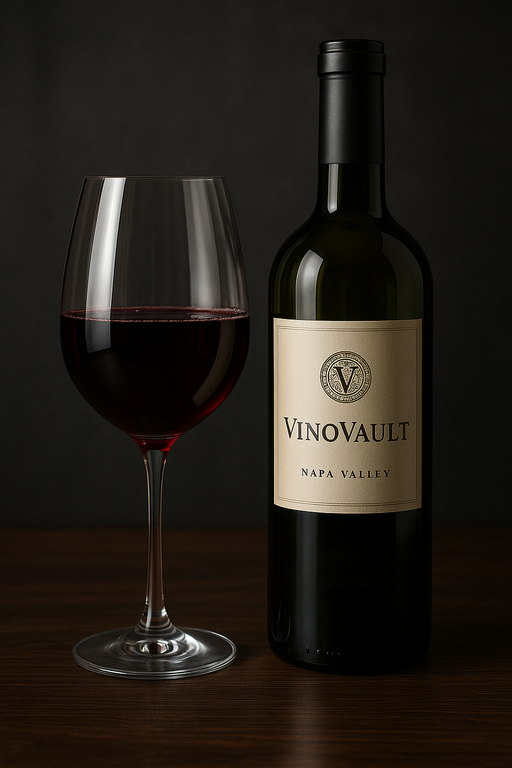

# VinoVault 🍷

VinoVault is a sleek, modern wine collection web application that allows users to catalog, view, and share wines in a personalized digital cellar. Built using Node.js, Express, EJS, and MongoDB, it offers a visually elegant and user-friendly way to keep track of your wine preferences.

## 🚀 Features

- User authentication and session management
- Add, edit, and delete wine entries
- View a public wine collection from all users
- Filter wines by type, region, or varietal
- Elegant UI with custom styling

## 🛠️ Tech Stack

- **Frontend:** HTML, CSS, EJS
- **Backend:** Node.js, Express.js
- **Database:** MongoDB + Mongoose
- **Authentication:** express-session, bcrypt

## 📸 Screenshots

### Prerequisites

- Node.js installed
- MongoDB running locally or MongoDB Atlas account

### Installation

Planning link: https://trello.com/b/4QTwm3Ed/project-2

Deployed link: https://vinovault-889b1e43da2d.herokuapp.com/

## Attributes

ChatGPT - All images were generated through ChatGPT

